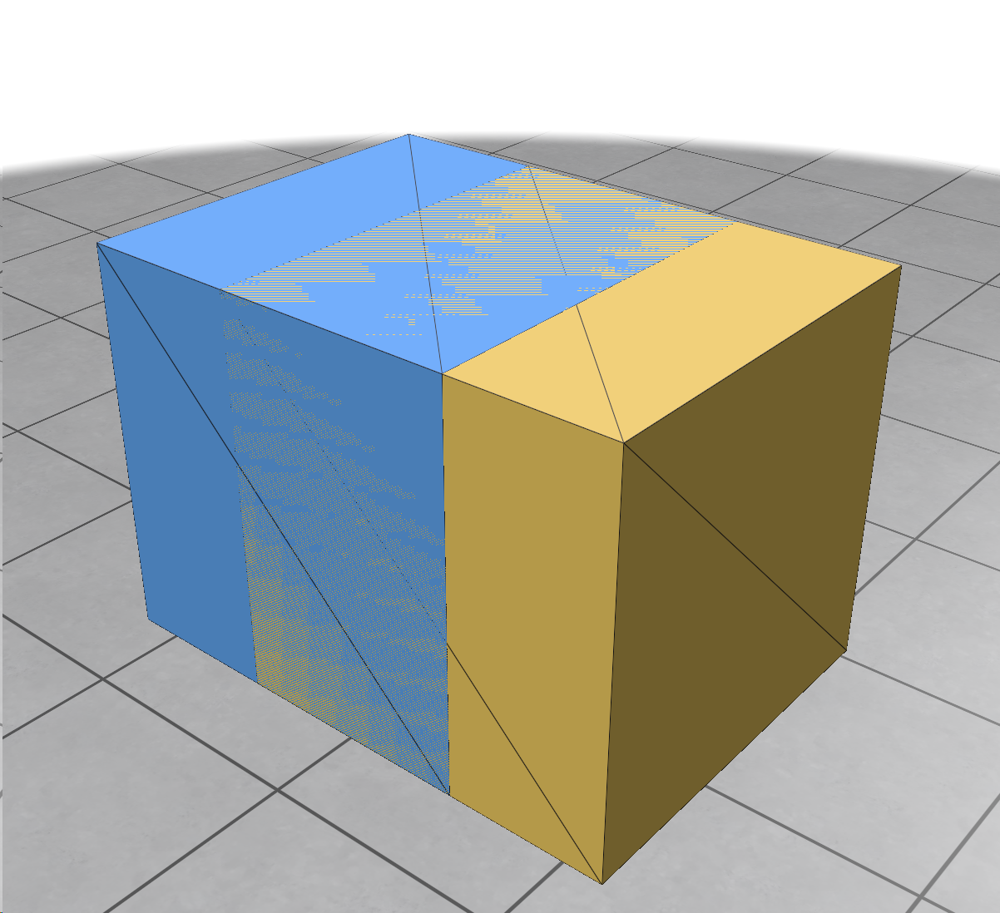

# Subscene

This example demonstrates how to create subscenes and manage the contact relationships between them.



In this example, we place two cubes with intersection, because they belong to different subscenes, they will not collide with each other. However, both cubes can collide with the ground plane, which belongs to the default subscene.

New born subscenes always contact with itself but not contact with other subscenes. 

```python
default_element = scene.subscene_tabular().default_element()
subscene_1 = scene.subscene_tabular().create('#1')
subscene_2 = scene.subscene_tabular().create('#2')
```

If you want to change the contact relationship, you can use `insert` method. 

```python
scene.subscene_tabular().insert(default_element, subscene_1, True)
scene.subscene_tabular().insert(default_element, subscene_2, True)
scene.subscene_tabular().insert(subscene_1, subscene_2, False)
```

The third parameter is a boolean value, `True` means contact enabled, `False` means contact disabled.